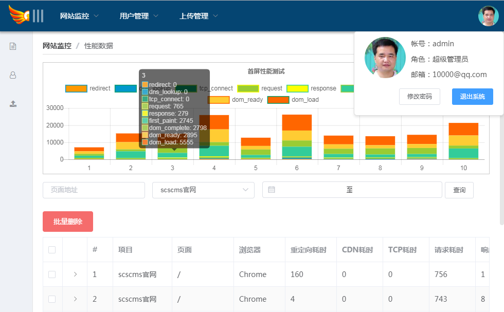

# 前端监控系统V3.1.0<sup>monitor</sup>

前端监控系统

    监测各系统前端异常错误，旨在及时了解和掌握各系统问题，及时修复。附加防劫持功能。



### 项目fork

本系统后台存储基于[vue-scscms](https://github.com/scscms/vue-scscms)系统。

### 前言

目前一般网站都前后端分离，新框架vue,React等更是如此。但往往网站出现bug或者问题时，我们一下难以判断是前端还是后端的问题。前端同事也一般无法了解整个网站的安全及运行状况，如果此网站对公司极其重要，前端同事有责任要立刻重视起来：必须对此网站重点监护，对重要的api接口调用失败做记录，捕捉系统各种错误，及做好各种前端埋点统计。

### 安装

请先执行CMD命令(告诉puppeteer安装时不要下载Chromium)。然后克隆项目并安装：

```
set PUPPETEER_SKIP_CHROMIUM_DOWNLOAD=1

git clone https://github.com/scscms/scs-monitor.git

npm install
```
然后去`https://github.com/scscms/Chrome`下载`Chromium.rar`并解压在本项目里，并核验`server/api.js`第26行文件地址是否正确。

- mysql数据库

首先安装mysql和新建用户等，教程自行解决。
接着在mysql新建数据库和建表，为了方便操作在此已经提供sql文档：参见`server/mysql.sql`
安装好数据库后，因没注册用户功能，所以需要执行sql语句来添加管理员：

```

INSERT INTO user (user_name,pass_word,user_type,user_email) VALUES ('admin','$2a$10$nPE/kBN4B53bdvWE2ykcNeDtiOFfAMTrv.q1MPiWnxhkO3rQbjSEa',1,'10000@qq.com');

```

执行上面sql语句后可插入用户：`admin`  密码：`admin123` 帐户(前提是 `config.js JWTs.secret='scscms'`没有修改)。

- 配置服务器及端口

然后打开文件`server/config.js`修改数据库和邮箱配置（邮箱暂没使用）。


```
npm run dev  #开发前端
npm run server #开发后端
npm run start  #开发前后端
npm run build  #打包构建
npm run lint  #语法检查并修复
```

至此前端监控后台搭建起来了，等着各系统上报数据...

### 常见问题

- Error: Cannot find mondule 'puppeteer'

如果出现以上错误，请单独重新安装插件 `npm install puppeteer-cn -D`

原因是`puppeteer-cn`依赖`puppeteer`。而`puppeteer`并没写入`package.json`文件里，当你安装新模块时会自动删除`puppeteer`模块。
- 注意：您又不能手动去安装`puppeteer`，原因是`puppeteer`安装复杂，而`puppeteer-cn`就是它的替代品。


### 邮箱配置
为了能正常使用邮箱汇报网站异常，请在 `server/config.js` 里配置好邮箱。

### 前端上报方法

参见 [js/README.md](./js/README.md)

### 升级日志

* V3.0.1
    1.添加view_time用户停留时间统计 2018-6-25

    2.改写console捕获日志上报 2018-6-25
    
* V3.0.2
    1.删除key属性，共用code属性。2018-6-27
    
    2.添加了图表展示。2018-6-29

* V3.0.3
    1.使用了 `puppeteer-cn` 插件集成自动触发首屏性能测试。2018-7-2
    
* V3.0.4
    1.更换了图表工具 `chart.js` 具有缩放功能。2018-7-6
    
    2.添加了简单的 `pv` 统计。2018-7-6
* V3.1.0
    1.使用vue-cli3.x生成脚手架 2018-10-18
    
    2.添加了`fps`渲染帧率异常检测 2018-10-19
